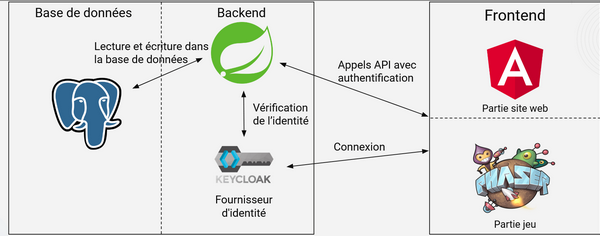
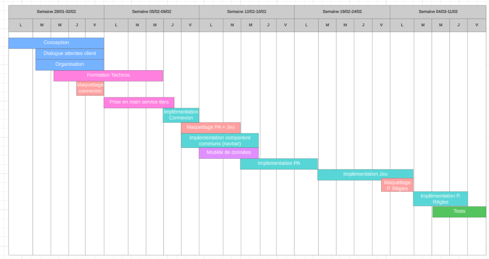
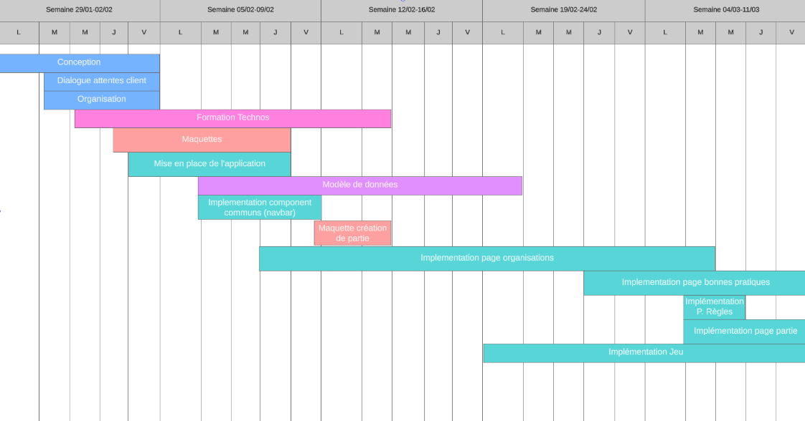
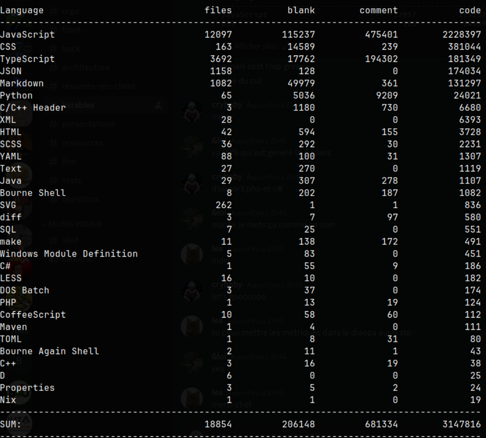

# Rapport du projet 1 : Digitaliser le serious game « 1T de bonnes pratiques de Green IT »

## Rappel du sujet

Afin de sensibiliser les membres du monde de l'électronique et de l'informatique (les développeurs, architectes, product owner) autour de l'impact phénoménal du numérique sur le progrès de la société, la société CGI a décidé de créer un nouveau jeu dans le but de donner les bonnes pratiques pour agir sur cet impact. 

Ce jeu est un jeu de société sérieux sous forme de jeu de cartes à jouer qui contient plusieurs types de cartes dont les cartes Sensibilisation, les cartes Bonnes Pratiques, les cartes Mauvaises Pratiques et les cartes de Formations. Les règles de ce jeu sont simples. Tout d’abord, chaque joueur doit poser une carte de Sensibilisation pour commencer la partie. Une fois cette carte est posée, les joueurs peuvent poser une carte de Bonnes Pratiques ou une carte de Formation à chaque tour. Ensuite, chaque joueur doit piocher une carte après le tour de chacun des joueurs.

Une fois une carte posée sur le plateau d’un des joueurs ou même défaussée, les joueurs discutent entre eux autour de cette carte. Ces discussions peuvent engendrer des débats éducatifs.

Pour bloquer un certain joueur, un joueur peut poser une carte de Mauvaises Pratiques sur le plateau du joueur en question. Quand un joueur est bloqué, il ne peut plus jouer d’autres cartes. Cependant, le joueur peut annuler l'effet de cette carte avec une carte Formation qui est du même type que celle de Mauvaises Pratiques. (Dans le cas où, le joueur n’a pas une carte de Formation, il est obligé de défausser une carte et d’en repiocher une).

Le joueur gagnant est le premier joueur à avoir atteint 1000 kg (1 tonne) de cartes de Bonnes Pratiques.

## Besoins / Cahier des charges

### Besoins

Le but de ce projet est de digitaliser ce jeu de société et le rendre accessible sur Internet. Autrement dit, nous devons créer un site web où plusieurs personnes peuvent y accéder en distanciel, sans besoin de se déplacer. Donc, ce jeu doit être multi-joueurs, multilingue et qui permet d’offrir une expérience utilisateur très proche du jeu réel. Ce site web doit permettre aux utilisateurs de créer des organisations, où d’autres utilisateurs peuvent les rejoindre. Seuls les utilisateurs de la même organisation peuvent jouer ensemble.

Pour cela, nous devrons, dans un premier temps, nous former sur les technologies que nous allons utilisées (cf. Technologies employées). Ensuite, nous devrons des maquettes basses fidèle qui permettent de créer le visuel de toutes les interfaces qui doivent y avoir sur le site web (et d’avoir la confirmation de nos porteurs de projets vis-à-vis notre vision des interfaces) et servent à la conception graphique du jeu. Enfin, nous devrons réaliser le moteur de jeu et les animations du jeu (déposer une carte, piocher une carte …)

### Cahier des charges

En plus du jeu en tant que tel, nous avons dû créer un site internet permettant aux utilisateurs d’effectuer des actions de bases en lien avec le jeu. Il existe trois types d’utilisateur différents avec chacun des droits propres: 

- Le site est géré par un ou plusieurs administrateurs qui possèdent tous les droits (accès à la base de donnée, modifier les rôles...). Ils peuvent sélectionner certains utilisateurs et leur assigner le rôle de org-admin.
- Un org-admin peut gérer des organisations. Un org-admin peut inviter et supprimer des utilisateurs d'une organisation.
- Un utilisateur est le rôle de base de l'application. Il peut rejoindre des organisations publiques et créer et rejoindre des salons de jeu.

Un utilisateur doit pouvoir s’inscrire ou se connecter s’il veut jouer une partie. De plus, il doit rejoindre une organisation. Une organisation un groupe d'utilisateurs regroupés sous un nom (la plupart du temps un nom d’entreprise). Il existe deux types d'organisations:

- Des organisations publiques qui seront visibles par tout utilisateur connecté. N'importe qui peut demander à rejoindre ces organisations. Lorsqu'une demande pour rejoindre une organisation a été effectuée, le(s) org-admin de l'organisation peut accepter ou non la demande.
- Des organisations privées qui ne sont pas visibles et seulement joignables via une invitation envoyée par le(s) org-admin de l'organisation. Les personnes sont invitées via un lien qui les font automatiquement rejoindre l'organisation sans validation supplémentaire. Le lien n'est utilisable qu'une seule fois et possède une durée déterminée par le(s) org-admin. (Une invitation est aussi possible pour les organisations publics)

Un utilisateur doit également pouvoir enregistrer et suivre des bonnes pratiques qu’il aura sélectionnées durant des parties. Cette page, située sur le profil de l’utilisateur, montrerait des bonnes pratiques catégorisées (à faire, non applicables, déjà appliquées).

N'importe qui appartenant à une organisation peut créer une partie. L'utilisateur créant la partie sélectionne l'organisation avec laquelle il veut jouer et un salon est ensuite créé. Il suffit d'attendre que le salon soit plein (entre 3 et 5 joueurs) pour commencer à jouer.

L'utilisateur qui a créé la partie peut créer un lien d'invitation pour des personnes n'ayant pas encore de compte sur le site. Ce lien est valable jusqu'à ce que la partie se lance. Si une personne cliquant sur le lien ne possède pas de compte, on lui propose de créer un compte pour pouvoir ensuite rejoindre le salon de jeu. Sinon, le lien mène directement au salon.

Pour rejoindre une partie publique, il suffit de parcourir la liste des salons libres. Les salons affichés ont été créés à partir d'organisations publiques, donc n'importe qui appartenant à ces organisations peuvent les rejoindre.

L’application doit également être multilingue.

## Technologies employées

Nous avons utilisé pour ce projet plusieurs technologies, qui nous permettent de réaliser certaines tâches. Ces technologies se divisent en plusieurs catégories en technologies pour le développement Front-End, Back-End, hébergement du code produit …

Pour le développement Front-End, nous avons utilisé Angular et les composants de PrimeNg, parce qu’ils ont été conseillés par nos porteurs de projet.

Pour le développement Back-End, nous avons utilisé Spring Boot Java.

Pour gérer l’authentification des utilisateurs et la sécurité du site web, Keycloak.

Pour la base de données, PostgresQL.

Nous avons également utilisé Docker Compose pour organiser les différents containers que nous avons utilisés. En effet, Keycloak et et Postgres fonctionnent à l’aide d’images docker et ceux-ci sont utilisés par Java Spring grâce à la gestion multiple de containers à l’aide de Docker Compose.

Pour réaliser les maquettes, nous nous sommes servis de Figma.

Pour l’hébergement du code, github.

## Architecture technique

Nous avons ici une architecture 3-tier avec donc la partie frontend, la partie serveur et la base de données. La partie frontend est divisée en deux car nous avons utilisé Angular pour le site internet (créer une partie, rejoindre une organisation…) et Phaser pour la partie jeu (animation, interactions utilisateur…)

## Réalisations techniques

Tout d’abord, nous avons commencé par développer la page d'accueil avec la barre de navigation. La page d’accueil est la page qui permet de voir toutes les organisations auxquelles l’utilisateur appartient. Dans cette page, nous pouvons accéder à la page permettant d’afficher les détails de chaque organisation, à celle permettant la modification des informations de chaque organisation, dont l’ajout ou la suppression de membres, et à celle permettant la création de nouvelle organisation. Cette dernière est réservée qu’aux administrateurs.

Ensuite, nous avons la page qui permet de créer une partie de jeu. Une autre page permet également de consulter les règles du jeu.

Les pages de connexion, inscription sont faites par Keycloak, et intégrées sur Angular.

Keycloak est un produit open source permettant l’authentification d’utilisateur, avec la gestion des accès via des rôles que l’on peut créer. L’utilisation de Keycloak a été proposée par les porteurs de projet, pour nous permettre d’intégrer facilement au sein du projet un système d’authentification sans devoir à en créer un de zéro. L’avantage de Keycloak comparé à la concurrence est son côté open source, il est facile d’installer une version en interne dans un serveur personnel, et de passer par sa propre base de données sans frais. Cela ajoute une couche de sécurité en plus avec moins de risque de faille qui peut-être causé lors du développement de zéro d’un système de gestion de l’authentification et de droit. Cela nous permet également de facilement intégrer des moyens d’authentification via des applications  ou des comptes externes de l’utilisateur, tels que Google, Facebook etc… Cela nécessite seulement de créer des comptes utilisateurs en tant que développeur auprès de ses plateformes. Pour l’implémentation de Keycloak au sein de notre application, nous avons tout d’abord tester la solution sur un projet neuf, pour voir les différentes possibilités d’implémentation. Nous souhaitions tout d’abord déployer keycloak sur un serveur externe, et réaliser des appels REST depuis notre backend qui servirait d'intermédiaire entre le front et la gestion des droits utilisateurs. Mais par la suite nous avons remarqué que cela était plus difficile à mettre en place, étant donné que certaines routes de l’api keycloak nécessité des droits administrateur pour pouvoir être appelé, cela nous force alors à chaque appels que nous devions faire depuis le back end vers keycloak, de s’identifier à un compte administrateur, de récupérer le token généré, et de l’utiliser par la suite pour réaliser les actions que nous souhaitons vers Keycloak. Cela ajoute une complexité en plus au niveau du développement qui n'était pas réellement nécessaire. Nous avons donc par la suite décidé de tout passer par l’interface Keycloak, l'authentification, la perte de mot de passe, l’inscription etc… Lorsque l’utilisateur souhaite se connecter, il sera redirigé alors vers cette interface pour réaliser l’action qu’il souhaite, et après l’aboutissement de cette action, il sera par la suite redirigé vers notre interface visuelle.

La partie backend a été développée avec Java Spring. Nous avons réalisé une API REST qui permet à la partie frontend d'interagir avec la base de données pour écrire et lire. Le serveur gère également la sécurité en vérifiant les droits sur les requêtes en vérifiant le token JWT généré par keycloak grâce aux rôles définis dans keycloak.

Pour le développement du jeu, nous avons décidé de partir sur Phaser js. C’est un framework de jeu 2D des jeux HTML5, pour ordinateur de bureau et mobile. Phaser js se base sur Pixi js qui est une bibliothèque open source permettant de réaliser des animations 2D et interactives. L’objectif étant que le jeu soit jouable sur ordinateur de bureau et mobile, et étant novice dans le développement de jeu, le fait qu’il y a sur internet énormément de documentation sur le développement de jeu avec cette librairie, de documentation sur la façon dont ont peut facilement l’intégrer au sein d’un projet Angular nous a incité à choisir Phaser. Le développement du jeu n’ayant pas trop avancé, nous pouvons affirmer que Phaser grâce à son tutoriel d’introduction présent sur son site, et les différents tutoriels que nous avons trouvé sur le internet, a était très facile à prendre en main et très intuitif. Pour le côté multijoueur du jeu, l’utilisation des websocket était envisagée.

## Gestion de projet

### Rôles

Nous nous sommes organisés comme cela pour ce projet :

- Léa Maida : Scrum master
- Aziz Khelifi : Développeur
- Fikret Kürklü :  Tech lead
- Eloi Charra: Chef de projet 

### Méthode

Nous avons utilisé la méthode agile durant ce projet. Des sprints d’une semaine ont été organisés avec une réunion hebdomadaires avec les porteurs du projet. Chaque semaine, nous nous attribuons des tâches à réaliser avant la prochaine réunion. Nous avons utilisé l’outil Trello pour nous répartir les tâches et garder une trace des réalisations. Cet outil a particulièrement été utilisé au début du projet puisqu’au fur et à mesure nous avions pris l’habitude de nous organiser et de discuter en face en notant sur des tableaux.

### Planning 

#### Prévisionnel

Voici le planning à gros grain que nous avions envisagé au début du projet. Nous pouvons remarquer une grande partie de formation et de découverte des technologies.

#### Effectif

Le planning effectif ressemblerait à ceci. Nous pouvons remarquer que la première phase du projet consistant à la formation sur les technologies et les prototypages a duré plus longtemps que prévu. La création du modèle de données s’étend sur plusieurs jours car nous avons eu des difficultés à le mettre en place. Nous sommes beaucoup revenu sur celui-ci pour le modifier, encore à l’heure actuelle quelques modifications sont à prévoir.

Nous pouvons également souligner que l’implémentation du jeu en tant que tel a commencé tardivement. Dû à un manque d’organisation dans la priorisation des tâches, nous avons trop tardé à commencer le développement du jeu.
De plus, globalement, les créations de pages ont été plus longues que prévues dû à un manque de connaissance des technologies et divers problèmes.

## Outils

Mis à part Trello et Github, aucun autre outil n’a été utilisé.

## Métriques logiciels

Voici le résultat après avoir lancé cloc à la racine du projet:

On peut noter que la plupart des informations ici sont concernant du code dont nous n’avons pas touché et qui a été généré par les technologies utilisées.

Répartition des lignes de code et des commit par personne :

Aziz : 25%
Léa : 25%
Fikret : 18%
Eloi : 32%

## Conclusion

Pour conclure concernant ce projet, il a premièrement été très enrichissant. Que cela soit du côté technique, avec l’assimilation de nouvelles technologies pour l’ensemble des membres du groupe. Certains membres connaissaient déjà le développement web mais créer un jeu a été un challenge inattendu qui nous a été bénéfique. Nous avons appris à construire un site internet pratiquement de zéro avec des outils et méthodes méconnus.

 Le projet a représenté également une plus-value dans l’aspect gestion de projet et humain. En effet, nous n’avons pas atteint les objectifs mis en place à la phase initiale du projet. Comme dit précédemment, cela est dû à un problème d’organisation sur les tâches et particulièrement sur la priorisation de celles-ci. Nous avons commencé à développer la partie jeu trop tardivement et la conséquence a été de ne pas avoir finalisé cette partie. Nous nous sommes trop concentrés sur la partie site en plus des problèmes liés à ces implémentations et la formation sur le tas.

Ce projet nous a également appris à réaliser une application pour un véritable client. C’était la première fois pour la plupart des membres du groupe de devoir concevoir un projet informatique avec un réel but. Nous avons appris à échanger avec des porteurs de projet, à proposer des solutions et entendre les retours.

Bien que le projet ne soit pas fini, nous restons tout de même sur une note positive. Nous tenons à remercier Julien Cognet et Sébastien Chassande-Barrioz pour avoir proposé ce projet ainsi que de nous avoir apporté leur expertise et des conseils tout au long du projet.
